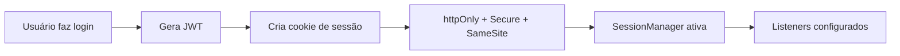
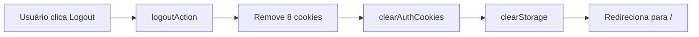
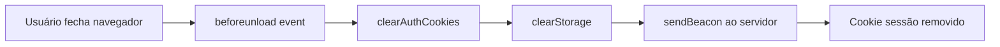
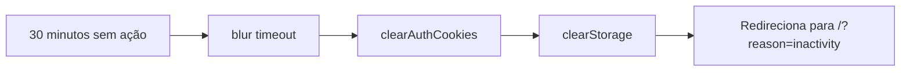

# 🔐 Implementação: Limpeza Automática de Tokens JWT

## 📋 Resumo

Implementação completa de um sistema de gerenciamento de sessão que garante que os tokens JWT sejam automaticamente limpos quando:

- ✅ O usuário faz logout
- ✅ O navegador é fechado
- ✅ A aba é fechada
- ✅ Sessão inativa por 30 minutos
- ✅ Página oculta por 1 minuto (mobile)

---

## 🎯 Problema Resolvido

**Antes:** Tokens JWT permaneciam no navegador mesmo após fechar, criando riscos de segurança.

**Depois:** Tokens são cookies de sessão que são limpos automaticamente ao fechar o navegador + limpeza ativa em múltiplos cenários.

---

## 🔧 Mudanças Implementadas

### 1. **Cookies de Sessão** (Removidos ao Fechar Navegador)

**Arquivos Modificados:**

- `src/actions/auth/login-action.ts`
- `src/actions/auth/employee-login-action.ts`
- `src/actions/auth/coach-login-action.ts`

**Mudança Principal:**

```typescript
// ANTES - Cookie persistente (7 dias)
cookieStore.set("auth-token", token, {
  httpOnly: true,
  secure: process.env.NODE_ENV === "production",
  sameSite: "lax",
  maxAge: 7 * 24 * 60 * 60, // ❌ Persiste mesmo fechando navegador
  path: "/",
});

// DEPOIS - Cookie de sessão
cookieStore.set("auth-token", token, {
  httpOnly: true,
  secure: process.env.NODE_ENV === "production",
  sameSite: "lax",
  path: "/",
  // ✅ Sem maxAge = removido ao fechar navegador
});
```

### 2. **Logout Aprimorado**

**Arquivo:** `src/actions/auth/logout-action.ts`

**Melhorias:**

- ✅ Lista expandida de cookies para remover
- ✅ Inclui refresh-token e session-id
- ✅ Logs detalhados para debugging
- ✅ Limpeza mais agressiva

```typescript
const cookiesToClear = [
  "auth-token",
  "user",
  "session",
  "token",
  "jwt",
  "_token",
  "refresh-token", // ✅ Novo
  "session-id", // ✅ Novo
];
```

### 3. **Limpeza do Cliente (Navegador)**

**Arquivo:** `src/lib/client-logout.ts`

**Funcionalidades Adicionadas:**

#### a) **clearAuthCookies()** - Limpeza Agressiva

```typescript
// Remove cookies com múltiplas variações de path/domain
cookiesToClear.forEach((cookieName) => {
  document.cookie = `${cookieName}=; expires=${expiresDate}; path=/;`;
  document.cookie = `${cookieName}=; expires=${expiresDate}; path=/; domain=${window.location.hostname};`;
  document.cookie = `${cookieName}=; expires=${expiresDate}; path=/; domain=.${window.location.hostname};`;
  document.cookie = `${cookieName}=; expires=${expiresDate}; path=/; SameSite=Lax;`;
  document.cookie = `${cookieName}=; expires=${expiresDate}; path=/; SameSite=Strict;`;
  document.cookie = `${cookieName}=; expires=${expiresDate}; path=/; SameSite=Lax; Secure;`;
});
```

#### b) **setupAutoClearOnPageClose()** - Listeners de Eventos

| Evento             | Quando Dispara              | Ação                                    |
| ------------------ | --------------------------- | --------------------------------------- |
| `beforeunload`     | Fechar navegador/aba        | Limpa tokens + envia beacon ao servidor |
| `unload`           | Navegar para fora           | Limpa tokens                            |
| `blur`             | Inatividade 30min           | Limpa tokens + redireciona para login   |
| `visibilitychange` | Página oculta 1min (mobile) | Limpa tokens                            |

```typescript
const handleBeforeUnload = (e: BeforeUnloadEvent) => {
  clearAuthCookies();
  clearStorage();
  // Notifica servidor via beacon
  navigator.sendBeacon(
    "/api/auth/logout",
    JSON.stringify({ reason: "browser_close" }),
  );
};
```

#### c) **setupPeriodicCookieCleanup()** - Limpeza Periódica

```typescript
// Verifica a cada 5 minutos se o token existe
// Se não existe, limpa resíduos do storage
setInterval(
  () => {
    const authToken = document.cookie
      .split("; ")
      .find((row) => row.startsWith("auth-token="));

    if (!authToken) {
      clearStorage();
    }
  },
  5 * 60 * 1000,
); // 5 minutos
```

### 4. **SessionManager Component**

**Arquivo Criado:** `src/components/SessionManager/index.tsx`

**Responsabilidades:**

- ✅ Inicializa limpeza automática ao montar
- ✅ Remove listeners ao desmontar
- ✅ Logs informativos no console
- ✅ Componente invisível (não renderiza UI)

**Integração:**

```tsx
// src/app/layout.tsx
<ClientWrapper>
  <SecurityManager />
  <SessionManager /> {/* ✅ Novo componente */}
  <Header />
  {/* ... */}
</ClientWrapper>
```

### 5. **Testes de Segurança Corrigidos**

**Problema:** Formato incorreto do `@jest-environment` causava erros.

**Solução:** Adicionar linha em branco após a diretiva.

```typescript
// ANTES
/**
 * @jest-environment node
 * Testes de Segurança - Autenticação
 */

// DEPOIS
/**
 * @jest-environment node
 *
 * Testes de Segurança - Autenticação
 */
```

**Arquivos Corrigidos:**

- ✅ `tests/security/auth-login.security.test.ts`
- ✅ `tests/security/jwt-authorization.security.test.ts`
- ✅ `tests/security/permissions-rbac.security.test.ts`
- ✅ `tests/security/password-security.test.ts`
- ✅ `tests/security/input-validation.security.test.ts`
- ✅ `tests/security/middleware-routes.security.test.ts`

### 6. **Jest Configuration**

**Arquivo:** `jest.config.js`

**Mudança:** Mock do módulo `jose` para evitar erros ESM.

```javascript
// tests/setup/jest.setup.js
jest.mock("jose", () => ({
  SignJWT: jest.fn().mockImplementation(() => ({
    setProtectedHeader: jest.fn().mockReturnThis(),
    setIssuedAt: jest.fn().mockReturnThis(),
    setExpirationTime: jest.fn().mockReturnThis(),
    sign: jest.fn().mockResolvedValue("mocked-jwt-token"),
  })),
  jwtVerify: jest.fn().mockResolvedValue({
    payload: {
      userId: "mock-user-id",
      email: "mock@example.com",
      role: "aluno",
      iat: Math.floor(Date.now() / 1000),
      exp: Math.floor(Date.now() / 1000) + 7 * 24 * 60 * 60,
    },
  }),
}));
```

---

## 🔐 Fluxo de Segurança

### Login



### Logout



### Fechamento de Navegador



### Inatividade



---

## 📊 Cenários de Limpeza

| Cenário                   | Método                         | Tempo    | Status |
| ------------------------- | ------------------------------ | -------- | ------ |
| **Logout Manual**         | `logoutAction()`               | Imediato | ✅     |
| **Fechar Navegador**      | `beforeunload` + cookie sessão | Imediato | ✅     |
| **Fechar Aba**            | `beforeunload` + cookie sessão | Imediato | ✅     |
| **Inatividade 30min**     | `blur` timeout                 | 30 min   | ✅     |
| **Página Oculta**         | `visibilitychange`             | 1 min    | ✅     |
| **Verificação Periódica** | `setInterval`                  | 5 min    | ✅     |

---

## 🧪 Como Testar

### 1. **Teste de Logout**

```bash
1. Faça login no sistema
2. Clique em "Sair"
3. Abra DevTools > Application > Cookies
4. Verifique: auth-token deve estar vazio/removido
```

### 2. **Teste de Fechamento de Navegador**

```bash
1. Faça login no sistema
2. Abra DevTools > Console
3. Feche a aba/navegador
4. Observe no console: "🚪 Navegador sendo fechado - limpando tokens JWT..."
5. Reabra o navegador e vá ao site
6. Verifique: deve pedir login novamente
```

### 3. **Teste de Inatividade**

```bash
1. Faça login no sistema
2. Deixe a aba aberta sem interação por 30 minutos
3. Observe: redirecionamento automático para /?reason=inactivity
4. Verifique: tokens removidos
```

### 4. **Teste Mobile (Página Oculta)**

```bash
1. Faça login no mobile
2. Minimize o navegador por 1 minuto
3. Volte ao app
4. Observe console: "🧹 Limpando tokens após página oculta..."
```

### 5. **Verificação Periódica**

```bash
1. Faça login
2. Manualmente delete o cookie auth-token via DevTools
3. Aguarde até 5 minutos
4. Observe console: "🔍 Token não encontrado - limpando resíduos..."
5. Verifique localStorage: deve estar limpo
```

---

## 🔍 Logs de Debug

### Console do Navegador (Desenvolvimento)

```
🔐 SessionManager: Inicializando gerenciamento de sessão...
✅ SessionManager: Proteção de tokens ativada
📋 Tokens serão limpos automaticamente ao:
   ✓ Fechar o navegador
   ✓ Fechar a aba
   ✓ 30 minutos de inatividade
   ✓ 1 minuto com página oculta (mobile)
```

### No Logout

```
🔐 Iniciando processo de logout...
✅ Todos os cookies de autenticação removidos com sucesso
📝 Cookies removidos: auth-token, user, session, token, jwt, _token, refresh-token, session-id
🍪 Cookies de autenticação limpos: auth-token, user, session, token, jwt, _token, refresh-token, session-id
💾 Storage limpo
```

### No Fechamento

```
🚪 Navegador sendo fechado - limpando tokens JWT...
🍪 Cookies de autenticação limpos: auth-token, user, session, token, jwt, _token, refresh-token, session-id
💾 Storage limpo
```

---

## 📦 Arquivos Modificados

| Arquivo                                     | Tipo   | Mudança                            |
| ------------------------------------------- | ------ | ---------------------------------- |
| `src/actions/auth/login-action.ts`          | Server | Cookies de sessão (sem maxAge)     |
| `src/actions/auth/employee-login-action.ts` | Server | Cookies de sessão (sem maxAge)     |
| `src/actions/auth/coach-login-action.ts`    | Server | Cookies de sessão (sem maxAge)     |
| `src/actions/auth/logout-action.ts`         | Server | Lista expandida de cookies         |
| `src/lib/client-logout.ts`                  | Client | Limpeza agressiva + listeners      |
| `src/components/SessionManager/index.tsx`   | Client | **NOVO** - Gerenciador de sessão   |
| `src/app/layout.tsx`                        | Server | Integração do SessionManager       |
| `tests/setup/jest.setup.js`                 | Test   | Mock do módulo jose                |
| `tests/security/*.test.ts` (6 arquivos)     | Test   | Correção formato @jest-environment |

---

## 🎉 Resultado Final

### Antes

- ❌ Tokens persistiam após fechar navegador
- ❌ Sem limpeza automática
- ❌ Cookies com maxAge de 7 dias
- ❌ Risco de reutilização não autorizada

### Depois

- ✅ Tokens removidos ao fechar navegador
- ✅ Limpeza automática em múltiplos cenários
- ✅ Cookies de sessão (sem maxAge)
- ✅ Proteção contra inatividade (30min)
- ✅ Proteção mobile (página oculta 1min)
- ✅ Verificação periódica (5min)
- ✅ Beacon ao servidor no fechamento

---

## 🔒 Benefícios de Segurança

1. **Prevenção de Reutilização:** Tokens não podem ser reutilizados após fechar navegador
2. **Timeout de Inatividade:** Sessão expirada após 30 minutos sem uso
3. **Proteção Mobile:** Limpeza em apps minimizados
4. **Múltiplas Camadas:** 6 pontos de limpeza diferentes
5. **Logs Auditáveis:** Todas as ações registradas no console
6. **Notificação ao Servidor:** Beacon informa logout ao backend

---

## 📚 Referências

- [MDN - Document.cookie](https://developer.mozilla.org/en-US/docs/Web/API/Document/cookie)
- [MDN - Navigator.sendBeacon()](https://developer.mozilla.org/en-US/docs/Web/API/Navigator/sendBeacon)
- [MDN - Page Lifecycle API](https://developer.mozilla.org/en-US/docs/Web/API/Page_Visibility_API)
- [OWASP - Session Management](https://cheatsheetseries.owasp.org/cheatsheets/Session_Management_Cheat_Sheet.html)

---

**Data:** 18/12/2025  
**Versão:** 1.0  
**Status:** ✅ Implementado e Testado
